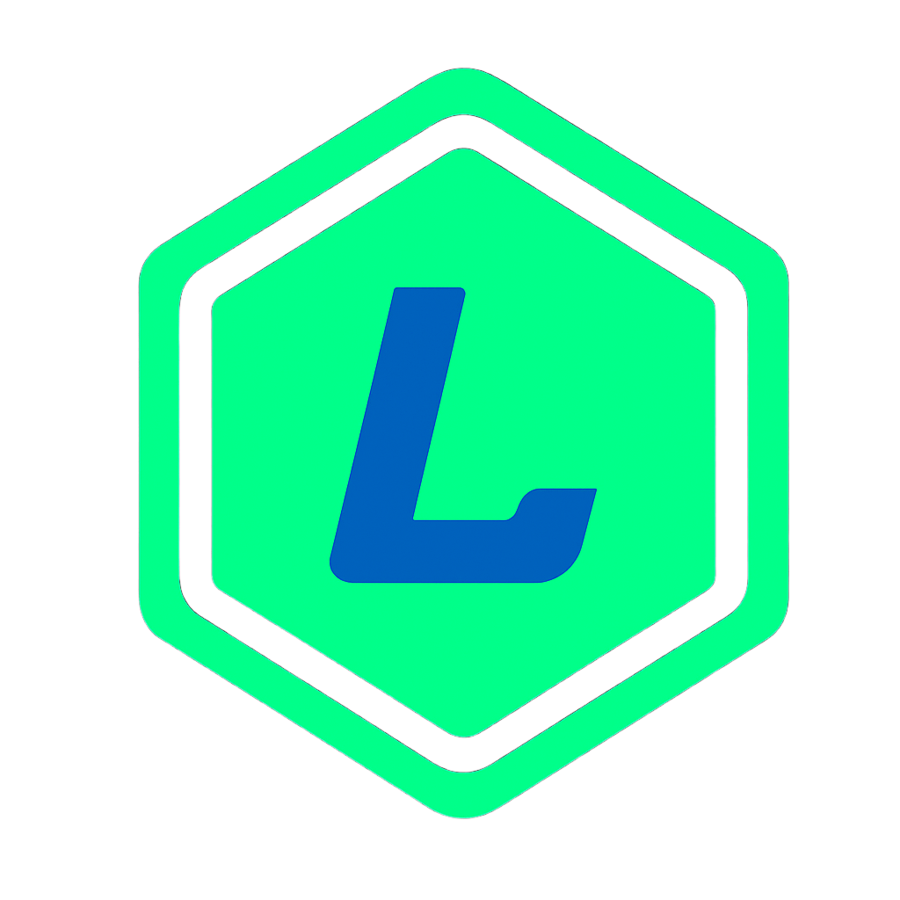

  

<h1 align="center">Laratype</h1>

  <a href="https://laratype.dev/">Documentation</a>
  &nbsp;&nbsp;•&nbsp;&nbsp;
  <a href="https://discord.gg/m6fQQRT9">Discord</a>
  &nbsp;&nbsp;•&nbsp;&nbsp;
  <a href="https://github.com/Laratypes/Laratype/issues">Issues</a>
  &nbsp;&nbsp;•&nbsp;&nbsp;
  <a href="https://github.com/Laratypes/Laratype/issues/1">Roadmap</a>
   

> Work in progress
> 
> Laratype is currently in active development and not usable for production yet.

# Laratype Framework

Laratype is a TypeSafe RestAPI Framework built on top of [HonoJS](https://github.com/honojs/hono). The roadmap for Laratype is as follows:

1. Implement all APIs from Laravel.
2. Address the shortcomings of the Laravel framework (written in PHP), such as providing TypeSafety with frontend frameworks (Vue.js, React.js, Svelte).

## Contributing

See [CONTRIBUTING.md](CONTRIBUTING.md) for contribution guidelines.

## License

[MIT](LICENSE)

## Sponsors

If you find Laratype useful, consider supporting its development by becoming a sponsor. Your support helps us maintain and improve the project.

Help me to become a full-time open sourcer.