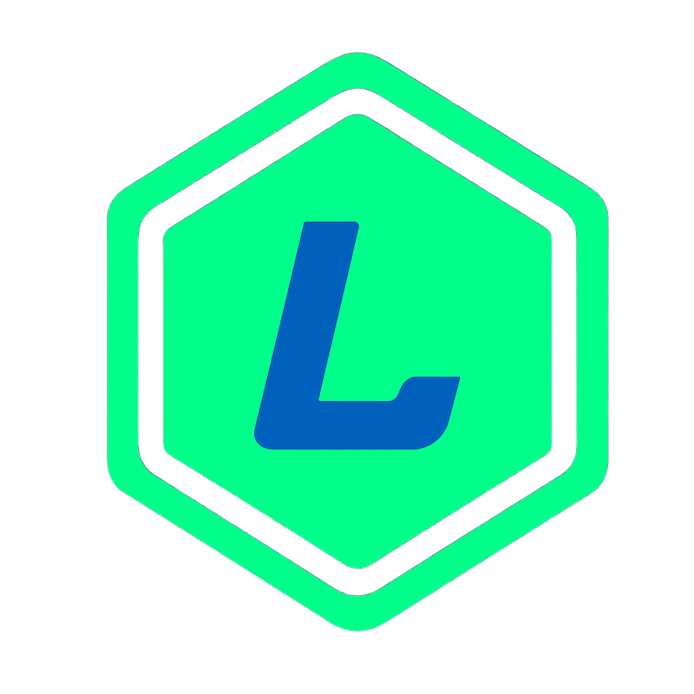

<p align="center">
  
</p>

<h1 align="center">Laratype</h1>

<p align="center">

</p>

<div align="center">
  <a href="https://laratype.dev/">Documentation</a>
  <span>&nbsp;&nbsp;•&nbsp;&nbsp;</span>
  <a href="https://github.com/Laratypes/Laratype/issues">Issues</a>
  <span>&nbsp;&nbsp;•&nbsp;&nbsp;</span>
  <a href="https://github.com/Laratypes/Laratype/issues/83">Roadmap</a>
  <br />
</div>

# Laratype Framework

Laratype is a type-safe REST API framework for TypeScript, built on [Hono](https://github.com/honojs/hono). It keeps Laravel's ergonomics (route files, FormRequest, Resources, Policies, facades, `sauf make:*`) and adds NestJS-style structure: a DI container and an explicit request pipeline. Types are carried end to end, from the endpoint contract to the frontend client.

## Status

> [!IMPORTANT]
> **v1 is in development and is not on npm.** The `master` branch holds the v1 redesign, which breaks compatibility with 0.5. The current npm release is **0.5.4**.

- **0.5.4 (npm):** docs at [laratype.dev/v0.5/](https://laratype.dev/v0.5/).
- **v1 (in development):** the user guide is at [laratype.dev](https://laratype.dev/). Progress is tracked in the roadmap, [#83](https://github.com/Laratypes/Laratype/issues/83).

## A first look at v1

A v1 endpoint is a runtime object that holds [Standard Schema](https://standardschema.dev) schemas (zod, valibot, arktype). The same object will drive validation, handler types, the frontend client and OpenAPI. This code is available on `master` in `@laratype/contract` and is type-checked in [`docs/v1/examples/contract/endpoint.ts`](docs/v1/examples/contract/endpoint.ts):

```ts
import * as z from 'zod'
import { endpoint, errors } from '@laratype/contract'

const UserDto = z.object({ id: z.number(), name: z.string() })

// One endpoint: method + Hono-style path, then optional slots in any order.
export const showPost = endpoint
  .get('/users/:user/posts/:post?')
  .query(z.object({ page: z.coerce.number().default(1) }))
  .response(UserDto)
  .errors(errors.notFound, errors.forbidden)

// Inferred from the endpoint:
//   params: { user: string; post?: string }
//   status: 200
//   error statuses: 404 | 403
```

Planned (not on `master` yet):

- Binding an endpoint to a controller method in a route file: planned → [#105](https://github.com/Laratypes/Laratype/issues/105).
- The typed frontend client, `createClient(appApi)`: planned → [#109](https://github.com/Laratypes/Laratype/issues/109).

## Packages

Status as recorded in [`docs/v1/overview.md`](docs/v1/overview.md#package-graph), which has the details and stays current. "0.5" means 0.5.x code that v1 will replace or port.

| Package | Role in v1 | Status |
|---|---|---|
| `@laratype/contract` | Endpoint builder, path params, error catalog, Standard Schema types | Available (C1, C2, C4). In review: C3 [#205](https://github.com/Laratypes/Laratype/pull/205), C5 [#204](https://github.com/Laratypes/Laratype/pull/204) |
| `@laratype/core` | DI container, tokens, dependency registry | Scaffold only. In review: D1 [#196](https://github.com/Laratypes/Laratype/pull/196), D2 [#201](https://github.com/Laratypes/Laratype/pull/201) |
| `@laratype/client` | Typed frontend client, `createClient(appApi)` | Scaffold only. API planned → [#109](https://github.com/Laratypes/Laratype/issues/109) |
| `@laratype/support` | `ServiceProvider` lifecycle (and 0.5 helpers) | 0.5. In review: ServiceProvider v2 [#202](https://github.com/Laratypes/Laratype/pull/202) |
| `sauf` | CLI, dev server, constructor DI transform | 0.5. In review: transform core [#194](https://github.com/Laratypes/Laratype/pull/194). Vite wiring planned → [#102](https://github.com/Laratypes/Laratype/issues/102) |
| `@laratype/http` | Router v2, request pipeline, controllers | 0.5. v1 planned → [#104](https://github.com/Laratypes/Laratype/issues/104), [#105](https://github.com/Laratypes/Laratype/issues/105), [#106](https://github.com/Laratypes/Laratype/issues/106) |
| `@laratype/validation` | FormRequest v2 on Standard Schema | 0.5. v1 planned → [#137](https://github.com/Laratypes/Laratype/issues/137) |
| `@laratype/auth` | Guards, typed `Register`, policies | 0.5. v1 planned → [#119](https://github.com/Laratypes/Laratype/issues/119), [#120](https://github.com/Laratypes/Laratype/issues/120), [#121](https://github.com/Laratypes/Laratype/issues/121) |
| `@laratype/database` | Eloquent-like Model | 0.5 (TypeORM). v1 waits for the ORM decision → [#88](https://github.com/Laratypes/Laratype/issues/88) |
| typegen (replaces `@laratype/ts-gen`) | `sauf types:generate` (`api.ts`, OpenAPI) | Planned → [#133](https://github.com/Laratypes/Laratype/issues/133), [#143](https://github.com/Laratypes/Laratype/issues/143) |
| `laratype` | Kernel / `Serve` | 0.5. In review: container boot [#202](https://github.com/Laratypes/Laratype/pull/202) |

The other 0.5 packages (`console`, `log`, `mail`, `i18n`, `schedule`, `broadcast`, `storage`) are ported later in v1; see [#83](https://github.com/Laratypes/Laratype/issues/83).

## Documentation

- [laratype.dev](https://laratype.dev/): the user guide (v1), with the 0.5.4 docs at [/v0.5/](https://laratype.dev/v0.5/).
- [`docs/v1/`](docs/v1/README.md): the internal v1 API spec for contributors. Start at [`overview.md`](docs/v1/overview.md).
- [`AGENTS.md`](AGENTS.md): rules for AI coding agents working in this repo.

## Contributing

See [CONTRIBUTING.md](CONTRIBUTING.md) for setup, commands and the branch and PR rules.

## License

[MIT](LICENSE)

## Sponsors

If you find Laratype useful, consider supporting its development by becoming a sponsor. Your support helps us maintain and improve the project.

Help me to become a full-time open sourcer.
